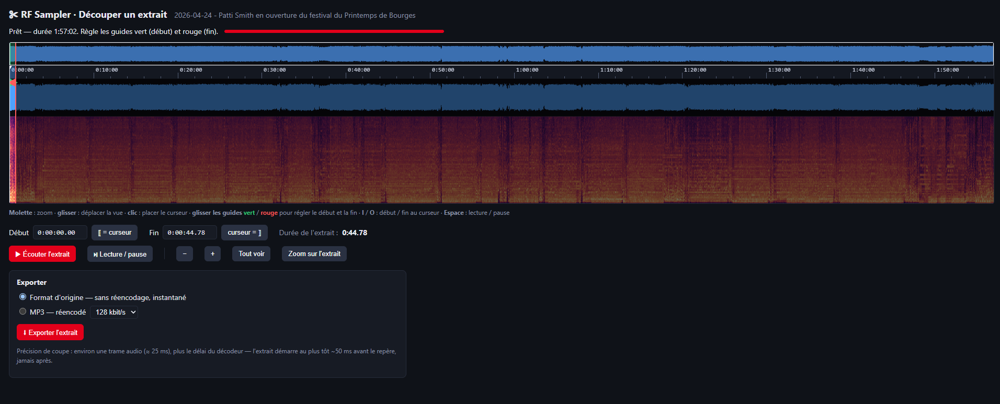
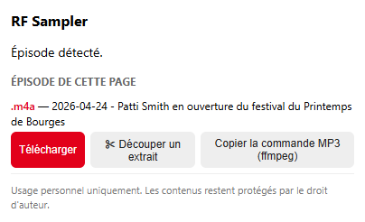

<p align="center"></p>

# RF Sampler

**RF Sampler** est une extension Chrome (Manifest V3) **non officielle** pour les podcasts de [radiofrance.fr](https://www.radiofrance.fr) :

- **Télécharge** le fichier audio de l'épisode affiché (m4a ou mp3), avec un nom de fichier propre (`date - titre`).
- **Découpe un extrait** dans un éditeur intégré : spectrogramme, forme d'onde, échelle de temps, guides
  *début* (vert) et *fin* (rouge) déplaçables, écoute de l'extrait, export sans perte ou en MP3.

> **Avertissement.** Projet indépendant, non affilié à Radio France, qui reste titulaire de ses marques et
> des droits sur ses contenus. Le nom « RF Sampler » et la couleur de l'icône sont un clin d'œil, sans reproduire de
> logo officiel. L'outil est prévu pour un **usage personnel** ; il t'appartient de respecter le droit d'auteur et les
> conditions d'utilisation du site. Aucun contenu n'est hébergé ici.

## Aperçu

<p align="center"></p>

<p align="center"><br><sub>Le popup, sur une page d'épisode</sub></p>

## Installation

L'extension n'est pas sur le Chrome Web Store : on l'installe « en mode développeur ».

1. Va dans [**Releases**](../../releases/latest) et télécharge `rf-sampler-vX.Y.Z.zip`.
2. **Dézippe-le dans un dossier que tu garderas** (ex. `Documents/extensions/rf-sampler`) : Chrome lit les
   fichiers depuis ce dossier, ne le supprime pas.
3. Ouvre `chrome://extensions`, active **Mode développeur** (en haut à droite).
4. Clique sur **Charger l'extension non empaquetée** et choisis le dossier dézippé.
5. Épingle l'icône (puzzle ▸ épingle) pour l'avoir sous la main.

Chrome peut afficher un avertissement « Désactiver les extensions en mode développeur » au démarrage : c'est
normal pour ce type d'installation. Conçue pour Chrome ; les navigateurs basés sur Chromium devraient
fonctionner (non testé).

**Mise à jour** : télécharge le nouveau zip, remplace le contenu du dossier, puis clique sur ⟳ sur la carte de
l'extension dans `chrome://extensions`.

## Utilisation

### Télécharger
Ouvre la page d'un épisode, clique sur l'icône → **Télécharger**. Les épisodes récents sont en **.m4a (AAC)**,
les plus anciens souvent en **.mp3** : le fichier est téléchargé tel que publié. Si rien n'est détecté, lance la
lecture de l'épisode puis rouvre le popup.

### Découper un extrait
Popup → **✂ Découper un extrait** (ouvre un onglet) :

| Action | Geste |
|---|---|
| Zoomer / dézoomer | molette |
| Déplacer la vue | glisser (ou cliquer dans la vue d'ensemble en haut) |
| Placer le curseur de lecture | clic |
| Régler début / fin | glisser les guides vert / rouge, ou saisir `h:mm:ss.cc` |
| Début / fin = curseur | touches **I** / **O** |
| Lecture / pause | **Espace** |

Puis **Exporter** :
- *Format d'origine* : coupe **sans réencodage** (instantanée, aucune perte).
- *MP3* (96–256 kbit/s) : réencodage ; pratique pour obtenir un MP3 à partir d'un m4a.

**Précision** : une trame audio (≈ 25 ms) plus le délai du décodeur. L'extrait démarre au plus tôt ~50 ms avant le
repère, jamais après (mesuré à ≈ 30 ms).

## Limites connues

- Le décodage audio de l'éditeur requiert Chrome (décodeur AAC).
- Pour un épisode d'une heure, l'analyse du spectre prend quelques secondes (par blocs de 2 min, affichage progressif).
- MP3 anciens : les toutes premières ms d'un extrait peuvent contenir un léger défaut de décodage (réservoir de bits).
- Les directs et flux HLS (`.m3u8`) ne sont pas gérés.
- Le site peut changer sa structure : la détection s'appuie sur le JSON-LD de la page (`contentUrl`) puis sur un
  balayage du code et des requêtes réseau.

## Confidentialité

Aucune donnée collectée, aucun serveur tiers, aucun code distant. Détails : [PRIVACY.md](PRIVACY.md).

## Développement

```text
extension/        code de l'extension (c'est ce dossier qui est zippé pour les releases)
  audiocut.js     découpe sans réencodage MP4/M4A (y compris fragmenté) et MP3
  dsp.js          spectrogramme (FFT)
  editor.*        éditeur d'extrait
  popup.*         popup de téléchargement
  background.js   détection des requêtes audio
docs/             captures d'écran du README
assets/           sources des icônes (SVG) — `icon.svg` (détaillée), `icon-small.svg` (16/32 px)
tests/            tests Node (node:test) — nécessitent ffmpeg
scripts/          vérifications (manifest) et génération des icônes
```

```bash
npm test          # = node --test tests/audiocut.test.js   (ffmpeg requis)
node scripts/check-manifest.js
npm install && npm run icons   # régénère les PNG depuis assets/*.svg
```

### Publier une version
1. Mets à jour `version` dans `extension/manifest.json` et ajoute une entrée dans `CHANGELOG.md`.
2. `git commit`, puis `git tag vX.Y.Z && git push --tags`.
3. Le workflow *Release* vérifie que le tag correspond à la version du manifest, lance les tests et publie le zip.

## Licence et crédits

Copyright © 2026 Thomas Garnier — logiciel libre sous licence **[GNU GPL v3.0](LICENSE)** (`GPL-3.0-only`) :
tu peux l'utiliser, l'étudier, le modifier et le redistribuer ; toute version modifiée que tu distribues doit rester
sous la même licence, avec son code source. Les icônes (`assets/`, `extension/icons/`) sont couvertes par la même licence.

L'export MP3 utilise [lamejs](https://github.com/zhuker/lamejs) (port JavaScript de LAME, **LGPL-3.0**), fourni tel
quel dans `extension/lame.min.js` — voir [THIRD_PARTY_NOTICES.md](THIRD_PARTY_NOTICES.md). La LGPL v3 est compatible
avec la GPL v3.
